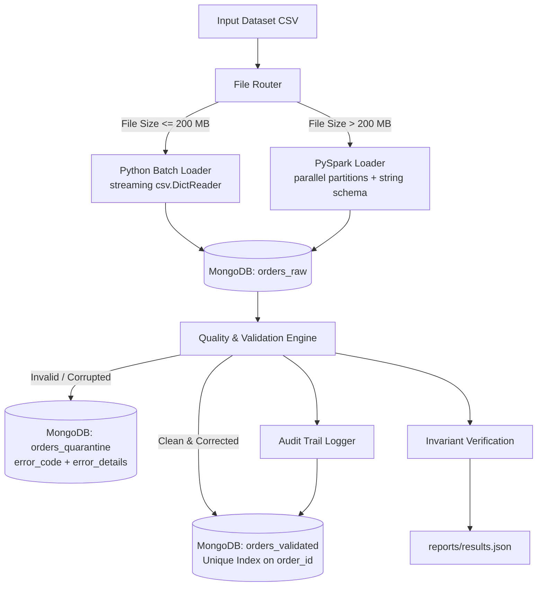

# Hybrid Big Data ELT Pipeline (Python Batch + PySpark + MongoDB)

An enterprise-grade, idempotent ELT data pipeline engineered to ingest, clean, normalize, validate, and store high-volume order datasets into MongoDB using a hybrid engine architecture (Python Batch streaming vs. Apache Spark).

---

## 1. System Architecture & ELT Philosophy



### Key Principles:
1. **Raw-First Ingestion (ELT):** 100% of incoming events are written into `orders_raw` without any pre-filtering or dropping. Each record is indexed by `run_id` and timestamped.
2. **Dynamic Routing:** Files $\le 200\text{ MB}$ use streaming memory-efficient Python batch processing; files $> 200\text{ MB}$ leverage PySpark distributed DataFrames.
3. **Idempotency Guarantee:** Validated records write exclusively through MongoDB `UpdateOne({"order_id": ...}, {"$set": ...}, upsert=True)` governed by a strict unique index. Re-running the pipeline on identical datasets yields `inserted_count == 0` and zero duplicate entries.
4. **Consistency Invariant:**
   $$\text{run\_raw\_count} = \text{valid\_count} + \text{corrected\_count} + \text{quarantine\_count}$$

---

## 2. Directory Layout

```text
midterm-data-pipeline/
├── requirements.txt
├── config/
│   ├── __init__.py
│   └── settings.py
├── src/
│   ├── __init__.py
│   ├── mongo_setup.py
│   ├── quality_rules.py
│   ├── file_router.py
│   ├── batch_loader.py
│   ├── spark_loader.py
│   ├── elt_pipeline.py
│   └── create_small_sample.py
├── tests/
│   ├── __init__.py
│   ├── test_cleaning_rules.py
│   └── test_idempotency.py
├── data/
│   └── test_dirty_orders.csv
├── reports/
│   └── results.json
├── main.py
└── README.md
```

---

## 3. Data Quality & Business Validation Rules

| Dimension | Rule & Normalization | Quarantine Error Code |
| :--- | :--- | :--- |
| **Phone Number** | Translates Arabic/Eastern numerals (`٠-٩`, `۰-۹`), removes punctuation/spaces, strips international codes (`+967`, `00967`, `967`) and trunk `0`. Validates strictly 9 digits starting with `77, 78, 73, 71, 70`. | `INVALID_PHONE_NUMBER` |
| **Customer ID** | Must not be `null`, empty string, or whitespace-only. | `MISSING_CUSTOMER_ID` |
| **Items Array** | Must be valid JSON list containing $\ge 1$ item. | `EMPTY_ITEMS` / `CORRUPTED_ITEMS_JSON` |
| **Order Time** | Standardized to ISO 8601 UTC (`YYYY-MM-DDTHH:MM:SSZ`). Verified within year range $[2000, 2030]$. | `INVALID_IMPOSSIBLE_DATE` |
| **Total Amount** | Strips currency notations (`YER`, `ريال`, `YR`), removes commas, converts Arabic digits, casts to float. Values $< 0$ flagged. | `AMBIGUOUS_NEGATIVE_VALUE` |
| **Order ID** | Stable business primary key. Must be present. | `MISSING_ORDER_ID` |

### Audit Trail
Whenever a record is corrected (e.g. phone normalized, date converted, currency stripped), an audit entry is recorded in the document's `corrections` array:
```json
{
  "field": "phone",
  "original_value": "+967 771-234-568",
  "corrected_value": "771234568",
  "rule_code": "PHONE_NORMALIZED"
}
```

---

## 4. Installation & Setup

### Prerequisites
- Python 3.10+
- MongoDB v5.0+ running locally on port 27017
- Java 17+ (for Apache Spark)

### Install Dependencies
```bash
pip install -r requirements.txt
```

---

## 5. Execution

### 1. Generate Dirty Test Dataset
```bash
python src/create_small_sample.py
```

### 2. Run Pipeline (Automatic Router)
```bash
python main.py --file data/test_dirty_orders.csv
```

### 3. Force Specific Engine
To explicitly use Python Batch:
```bash
python main.py --file data/test_dirty_orders.csv --engine batch
```

To explicitly use Apache Spark:
```bash
python main.py --file data/test_dirty_orders.csv --engine spark
```

### 4. Verify Idempotency
Re-execute the exact same command:
```bash
python main.py --file data/test_dirty_orders.csv
```
Observe that:
- `MongoDB Upserted (New)` = `0`
- `MongoDB Unchanged` = previous validated count
- Zero duplicate documents in `orders_validated`

All run statistics are automatically appended to `reports/results.json`.

---

## 6. Running Automated Tests

Run the complete test suite:
```bash
pytest tests/ -v
```
